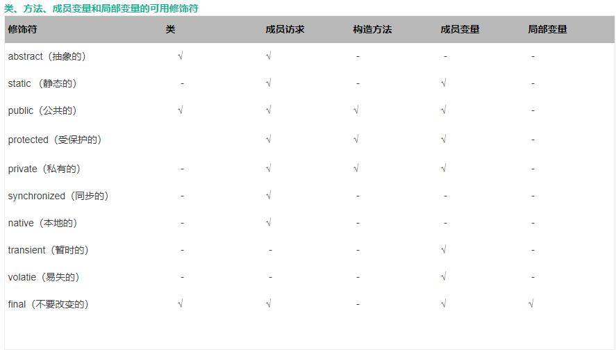

<!-- TOC -->

- [javastudy](#javastudy)
                - [最近整理笔记修改了笔记，如需转载请注明出处](#最近整理笔记修改了笔记如需转载请注明出处)
    - [import](#import)
        - [java常用包:](#java常用包)
    - [extends](#extends)
        - [继承](#继承)
        - [转型](#转型)
        - [instanceof运算符](#instanceof运算符)
        - [类的复用](#类的复用)
        - [包装类](#包装类)
        - [==和equal方法](#和equal方法)
        - [final修饰符](#final修饰符)
        - [抽象类](#抽象类)
    - [接口](#接口)
            - [this关键词的使用](#this关键词的使用)

<!-- /TOC -->


# javastudy 

  - [import](#import)
    - [java常用包:](#java%e5%b8%b8%e7%94%a8%e5%8c%85)
  - [extends](#extends)
    - [继承](#%e7%bb%a7%e6%89%bf)
    - [转型](#%e8%bd%ac%e5%9e%8b)
    - [instanceof运算符](#instanceof%e8%bf%90%e7%ae%97%e7%ac%a6)
  - [* Object类是所有类的父类。](#object%e7%b1%bb%e6%98%af%e6%89%80%e6%9c%89%e7%b1%bb%e7%9a%84%e7%88%b6%e7%b1%bb)
    - [类的复用](#%e7%b1%bb%e7%9a%84%e5%a4%8d%e7%94%a8)
  - [### 包装类](#%e5%8c%85%e8%a3%85%e7%b1%bb)
    - [==和equal方法](#%e5%92%8cequal%e6%96%b9%e6%b3%95)
    - [final修饰符](#final%e4%bf%ae%e9%a5%b0%e7%ac%a6)
    - [抽象类](#%e6%8a%bd%e8%b1%a1%e7%b1%bb)
  - [接口](#%e6%8e%a5%e5%8f%a3)
      - [this关键词的使用](#this%e5%85%b3%e9%94%ae%e8%af%8d%e7%9a%84%e4%bd%bf%e7%94%a8)
##### 最近整理笔记修改了笔记，如需转载请注明出处

- [Java多线程](./多线程.md)

- [泛型](./泛型.md)

- [工具类](./工具类.md)

- [基本数据类型包装类](./基本数据类型包装类.md) 

- [集合框架](./集合框架.md)

- [接口与内部类](./接口与内部类.md)

- [网络编程](./网络编程.md)

- [正则表达式](./正则表达式.md)

- [GUI编程](./GUI编程.md)

- [IO流](./IO流.md)

- [java反射](./java反射.md)

- [SSM框架](./SSM框架学习.md)

- [java小项目](./小项目.md)

- [java 并发编程笔记](./java并发.md)

- [lombok使用笔记](./lombok.md)





## import
### java常用包:
* java.lang:Java的核心库文件String，Math，System，Thread。无需导入
* java.util：Java工具和接口框架等，Arrays，List，Set等。
* java.net：java网络编程的类和接口。
* java.io：输入输出。
* java.text：java格式化的类
* java.sql:包含了java进行JBDC编程的类
* java.awt：抽象窗口工具集（GUI）
* java.swing：swing图形用户界面编程的相关类。  
  
## extends  
### 继承
* 关键字：extends（扩展)
* java的子类不能得到父类的构造器
* super父类    


### 转型
* 父类变量可以引用任何一个子类对象,而子类变量不能引用父类对象 
* 向上转型可能会丢失子类中多余的方法，特征（向上转型为子类对象赋值给父类引用变量）
* 向下转型（将父类实例转换为子类类型），那么这个对象的实际类型必须是子类类型。  


### instanceof运算符  

* 前面的类与后面的类相同或者有继承关系  
* Object类是所有类的父类。
---
### 类的复用
1. 可以使用类的继承，子类继承父类的特性形成复用。
2. 将原来的父类组合到原来的子类，作为子类的一个组成部分  
```java    
public class test1 {
    static class Animal {
        private void beat() {
            System.out.println("心脏在跳动");
        }

        public void breath() {
            beat();
            System.out.println("正在呼吸");
        }
    }

    class Bird {
        private Animal a;

        public Bird(Animal a) {
            this.a = a;
        }

        public void breath() {
            a.breath();
        }

        public void fly() {
            System.out.println("我在天空飞!");
        }
    }

    public static void main(String[] args) {
        Animal a1=new Animal();
        a1.breath();
    }
}
```

### 包装类
----
-  功能：  

    	将基本变量类型转换为对象类型（装箱）
		将对象类型转换为基本变量类型（拆箱） 

- 进行两个封装类的实例比较比较复杂，因为类实例实际是引用类型，两个包装类指向同一个对象才会TRUE。
- int类型中系统向-128——127的数字计入缓存，不会出现上述现象。
- compare方法（所有包装类都具有的类），参数为两个比较值。以此来比较基本数据类型是否相同

### ==和equal方法


-  ==如果为基本类型变量则比较数值，引用类型的话比较地址
-  equal判断两个引用变量的值是否相等（所有引用变量都可以调用）。

- <font color=#8470FF >推荐使用第一种。 </font>

### final修饰符
-  final修饰符修饰的成员变量必须显式的初始值，初始化后其值不能改变。
-  java不允许直接访问final访问的成员变量，需要使用方法来访问。

### 抽象类
- 抽象类和抽象方法的不同点
   - 抽象类和方法用abstract修饰，抽象类不能被实例化，只能通过被其他子类继承来定义方法。
   - private和abstract不能同时使用。

## 接口
- 接口的定义使用关键字interface 接口名 extends 父接口1，父接口2···
- 接口内不能含有构造器和初始化定义模块。（允许抽象方法，类方法和默认方法，私有方法。）
* 接口描述类具有什么功能,而不给出每个功能的具体实现.
* 一个类可以实现多个接口
- 接口中定义默认方法需要用default来修饰
- 接口的功能可以用来定义常量，被其它类实现。
- 接口的实现使用implement关键字，格式为
   ```java
    [修饰符] class 类名 extends 父类 implement 接口1，2···
    {

    }
    ```
```JAVA
package dataandvar.test;
   public interface output{
       int max=50;
       void out();
       void getdata();
       default void print(String []msgs)
       {
           for (String msg:msgs) {
               System.out.println(msg);
           }
       }
       default void test(){
           System.out.println("默认的test方法");
       }
       static String staticTest(){
           return ("接口类的test方法");
       }
   }
```
```JAVA
package dataandvar;

import dataandvar.test.output;

public class DataType {
    public static void main(String[] args) {
        System.out.println(output.max);
        System.out.println(output.staticTest());
    }
}
```

#### this关键词的使用
* 当定义类中功能时，该函数内部要用到该函数的对象时使用this来表示这个对象。
* this语句用于构造函数之间互相调用。
* this语句只能在构造函数的第一行。
```java
package object.test1;

class Test {
    private String name;
    private int age;

    Test(String name) {
        this.name = name;
    }

    Test(String name, int age) {
        this(name);
        this.age=age;
    }
```
