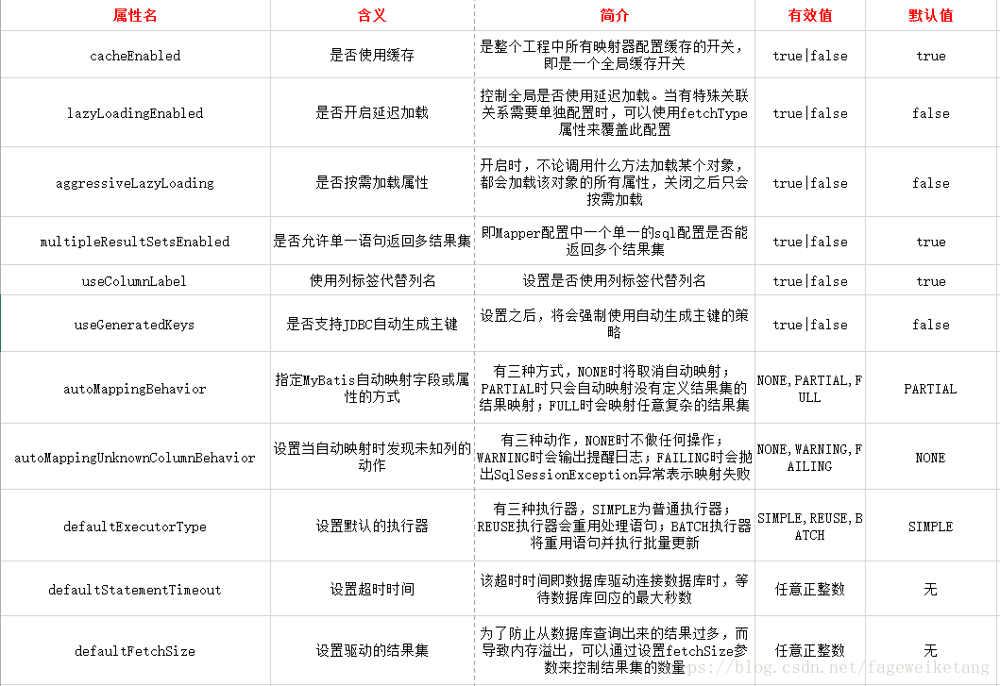
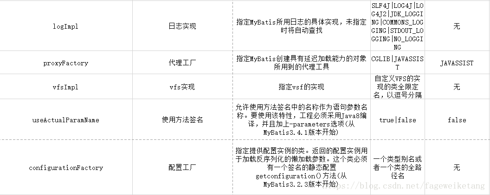

<!--961032830987546d0e6d54829fc886f6-->

目录(Catalo)

  * [<center>mybatis</center>](#%3Ccenter%3Emybatis%3C/center%3E)
      * [Mybatis](#Mybatis)
        * [ XML配置](#%20XML%E9%85%8D%E7%BD%AE)
        * [代码创建](#%E4%BB%A3%E7%A0%81%E5%88%9B%E5%BB%BA)
        * [利用mybatis实现简单的jdbc](#%E5%88%A9%E7%94%A8mybatis%E5%AE%9E%E7%8E%B0%E7%AE%80%E5%8D%95%E7%9A%84jdbc)
        * [properties文件配置](#properties%E6%96%87%E4%BB%B6%E9%85%8D%E7%BD%AE)
        * [映射器（Mappers）的引入方法](#%E6%98%A0%E5%B0%84%E5%99%A8%EF%BC%88Mappers%EF%BC%89%E7%9A%84%E5%BC%95%E5%85%A5%E6%96%B9%E6%B3%95)
      * [映射器](#%E6%98%A0%E5%B0%84%E5%99%A8)
        * [`select`](#%60select%60)
        * [分页参数RowBounds](#%E5%88%86%E9%A1%B5%E5%8F%82%E6%95%B0RowBounds)
        * [级联](#%E7%BA%A7%E8%81%94)
          * [mybatis中的级联分3类](#mybatis%E4%B8%AD%E7%9A%84%E7%BA%A7%E8%81%94%E5%88%863%E7%B1%BB)
      * [动态SQL](#%E5%8A%A8%E6%80%81SQL)

<!--a46263f7a69f33f39fc26f907cdb773a-->

#### Mybatis

- Mybatis的组件`构造器` `工厂接口` `会话` `映射器`

如果进行mybatis-Session的生成需要进行xml配置或者代码生成
#####  XML配置
```java
package Test;

import org.apache.ibatis.io.Resources;
import org.apache.ibatis.session.SqlSessionFactory;
import org.apache.ibatis.session.SqlSessionFactoryBuilder;

import java.io.IOException;
import java.io.InputStream;

public class Test {
    public static void main(String[] args) {
        SqlSessionFactory sqlSessionFactory=null;
        String resource="mybatis-config.xml";
        InputStream inputStream;
        try{
            inputStream= Resources.getResourceAsStream(resource);
            SqlSessionFactory sqlSessionFactory1=new SqlSessionFactoryBuilder().build(inputStream);
        }
        catch (IOException e)
        {
            e.printStackTrace();
        }
    }
}
```

- 配置文件
```xml
<?xml version="1.0" encoding="UTF-8" ?>
<!DOCTYPE configuration
        PUBLIC "-//mybatis.org//DTD Config 3.0//EN"
        "http://mybatis.org/dtd/mybatis-3-config.dtd">
<configuration>
    <typeAliases>
        <typeAlias alias="role" type="Test.Role"/>
    </typeAliases>
    <environments default="development">
        <environment id="development">
            <transactionManager type="JDBC"/>
            <dataSource type="POOLED">
                <property name="driver" value="com.mysql.jdbc.Driver"/>
                <property name="url" value="jdbc:mysql://localhost:3306"/>
                <property name="username" value="root"/>
                <property name="password" value="root"/>
            </dataSource>
        </environment>
    </environments>
    <mappers>
        <mapper resource="org/mybatis/example/BlogMapper.xml"/>
    </mappers>
</configuration>
```

##### 代码创建

```java
import Test.Role;
import Test.RoleMapper;
import org.apache.ibatis.datasource.pooled.PooledDataSource;
import org.apache.ibatis.mapping.Environment;
import org.apache.ibatis.session.Configuration;
import org.apache.ibatis.session.SqlSessionFactory;
import org.apache.ibatis.session.SqlSessionFactoryBuilder;
import org.apache.ibatis.transaction.TransactionFactory;
import org.apache.ibatis.transaction.jdbc.JdbcTransactionFactory;

public class Main {
    public static void main(String[] args) {
        PooledDataSource dataSource = new PooledDataSource();
        dataSource.setDriver("com.mysql.jdbc.Driver");
        dataSource.setUsername("root");
        dataSource.setPassword("root");
        dataSource.setUrl("jdbc:mysql://localhost:3306/jdbc");
        dataSource.setDefaultAutoCommit(false);

        TransactionFactory transactionFactory = new JdbcTransactionFactory();

        Environment environment = new Environment("development", transactionFactory, dataSource);
        //创建Configuration对象
        Configuration configuration=new Configuration(environment);
        //注册上下文别名
        configuration.getTypeAliasRegistry().registerAlias("role", Role.class);
        configuration.addMapper(RoleMapper.class);
        SqlSessionFactory sqlSessionFactory= new SqlSessionFactoryBuilder().build(configuration);
    }
}
```
Role.java
```java
package Test;

public class Role {
    private String name;
    private String brith;
    private Float money;

    public String getName() {
        return name;
    }

    public void setName(String name) {
        this.name = name;
    }

    public String getBrith() {
        return brith;
    }

    public void setBrith(String brith) {
        this.brith = brith;
    }

    public Float getMoney() {
        return money;
    }

    public void setMoney(Float money) {
        this.money = money;
    }
}
```

- 创建映射  
两种方法：  
1.XML创建  
XML创建需要在配置文件中增加
```xml
 <mappers>
        <mapper resource="RoleMapper.xml"/>
    </mappers>
```
2.代码创建
代码创建需要加
```java
configuration.addMapper(RoleMapper.class);
```
##### 利用mybatis实现简单的jdbc
main函数
```java
package Example;

import org.apache.ibatis.session.SqlSession;
import org.apache.log4j.Logger;

import java.util.List;

public class Main {
    public static void main(String[] args) {
        Logger log = Logger.getLogger(Main.class);
        SqlSession sqlSession = null;
        try {
            sqlSession = SqlSessionFactoryUtil.openSqlSession();
            Example.RoleMapper roleMapper = sqlSession.getMapper(Example.RoleMapper.class);
            Role role = roleMapper.getRole(1);
            List<Role> roles = roleMapper.findRoles("张三");
            for (Role s : roles) {
                log.info(s.getName() + "::" + s.getBirth());
            }
            Role role1=new Role();
            role1.setBirth("1999-1-1");
            role1.setMoney(100);
            role1.setName("李四");
            log.info(roleMapper.insertRole(role1));
            log.info(roleMapper.deleteRole(role1));
            log.info(role.getName() + "::" + "::" + role.getMoney());
        } finally {
            if (sqlSession != null)
                sqlSession.close();
        }
    }
}
```
角色POJO
```java
package Example;

public class Role {
    private int id;
    private String name;
    private String birth;
    private float money;

    public int getId() {
        return id;
    }

    public void setId(int id) {
        this.id = id;
    }

    public String getName() {
        return name;
    }

    public void setName(String name) {
        this.name = name;
    }

    public String getBirth() {
        return birth;
    }

    public void setBirth(String birth) {
        this.birth = birth;
    }

    public float getMoney() {
        return money;
    }

    public void setMoney(float money) {
        this.money = money;
    }
}
```
mybatis配置文件
```xml
<?xml version="1.0" encoding="UTF-8" ?>
<!DOCTYPE configuration
        PUBLIC "-//mybatis.org//DTD Config 3.0//EN"
        "http://mybatis.org/dtd/mybatis-3-config.dtd">
<configuration>
    <typeAliases>
        <typeAlias alias="role" type="Example.Role"/>
    </typeAliases>
    <environments default="development">
        <environment id="development">
            <transactionManager type="JDBC"/>
            <dataSource type="POOLED">
                <property name="driver" value="com.mysql.jdbc.Driver"/>
                <property name="url" value="jdbc:mysql://localhost:3306/jdbc"/>
                <property name="username" value="root"/>
                <property name="password" value="root"/>
            </dataSource>
        </environment>
    </environments>
    <mappers>
        <mapper resource="RoleMapper.xml"/>
    </mappers>
</configuration>
```
RoleMapper配置文件
```xml
<?xml version="1.0" encoding="UTF-8"?>
<!DOCTYPE mapper
        PUBLIC "-//mybatis.org//DTD Mapper 3.0//EN"
        "http://mybatis.org/dtd/mybatis-3-mapper.dtd">
<mapper namespace="Example.RoleMapper">
    <insert id="insertRole" parameterType="role">
        insert into test(name,birth,money)value (#{name},#{birth},#{money})
    </insert>
    <delete id="deleteRole" parameterType="int">
        delete from test where id=#{id}
    </delete>
    <update id="updateRole" parameterType="role">
        update test set name =#{name },brith=#{birth},money=#{money} where id=#{id}
    </update>
    <select id="getRole" parameterType="int" resultType="role">
        select id,name,birth,money from test where id=#{id}
    </select>
    <select id="findRoles" parameterType="string" resultType="role">
        select id,name,birth,money from test where name like concat('%',#{name},'%')
    </select>
</mapper>
```
log4j配置文件`log4j.properties`

```properties
log4j.rootLogger=Debug,stdout
log4j.logger.org.mybatis=DEBUG
log4j.appender.stdout=org.apache.log4j.ConsoleAppender
log4j.appender.stdout.layout=org.apache.log4j.PatternLayout
log4j.appender.stdout.layout.ConversionPattern=%5p %d %c :%m%n
```
运行结果
```java
DEBUG 2019-07-13 15:00:43,292 org.apache.ibatis.logging.LogFactory :Logging initialized using 'class org.apache.ibatis.logging.log4j.Log4jImpl' adapter.
DEBUG 2019-07-13 15:00:43,387 org.apache.ibatis.datasource.pooled.PooledDataSource :PooledDataSource forcefully closed/removed all connections.
DEBUG 2019-07-13 15:00:43,387 org.apache.ibatis.datasource.pooled.PooledDataSource :PooledDataSource forcefully closed/removed all connections.
DEBUG 2019-07-13 15:00:43,387 org.apache.ibatis.datasource.pooled.PooledDataSource :PooledDataSource forcefully closed/removed all connections.
DEBUG 2019-07-13 15:00:43,387 org.apache.ibatis.datasource.pooled.PooledDataSource :PooledDataSource forcefully closed/removed all connections.
DEBUG 2019-07-13 15:00:43,458 org.apache.ibatis.transaction.jdbc.JdbcTransaction :Opening JDBC Connection
DEBUG 2019-07-13 15:00:43,644 org.apache.ibatis.datasource.pooled.PooledDataSource :Created connection 795372831.
DEBUG 2019-07-13 15:00:43,644 org.apache.ibatis.transaction.jdbc.JdbcTransaction :Setting autocommit to false on JDBC Connection [com.mysql.jdbc.JDBC4Connection@2f686d1f]
DEBUG 2019-07-13 15:00:43,646 Example.RoleMapper.getRole :==>  Preparing: select id,name,birth,money from test where id=? 
DEBUG 2019-07-13 15:00:43,676 Example.RoleMapper.getRole :==> Parameters: 1(Integer)
DEBUG 2019-07-13 15:00:43,691 Example.RoleMapper.getRole :<==      Total: 1
DEBUG 2019-07-13 15:00:43,692 Example.RoleMapper.findRoles :==>  Preparing: select id,name,birth,money from test where name like concat('%',?,'%') 
DEBUG 2019-07-13 15:00:43,692 Example.RoleMapper.findRoles :==> Parameters: 张三(String)
DEBUG 2019-07-13 15:00:43,693 Example.RoleMapper.findRoles :<==      Total: 2
 INFO 2019-07-13 15:00:43,693 Example.Main :张三::1985-01-01
 INFO 2019-07-13 15:00:43,693 Example.Main :张三::2019-01-01
DEBUG 2019-07-13 15:00:43,693 Example.RoleMapper.insertRole :==>  Preparing: insert into test(name,birth,money)value (?,?,?) 
DEBUG 2019-07-13 15:00:43,693 Example.RoleMapper.insertRole :==> Parameters: 李四(String), 1999-1-1(String), 100.0(Float)
DEBUG 2019-07-13 15:00:43,694 Example.RoleMapper.insertRole :<==    Updates: 1
 INFO 2019-07-13 15:00:43,694 Example.Main :1
DEBUG 2019-07-13 15:00:43,694 Example.RoleMapper.deleteRole :==>  Preparing: delete from test where id=? 
DEBUG 2019-07-13 15:00:43,694 Example.RoleMapper.deleteRole :==> Parameters: 0(Integer)
DEBUG 2019-07-13 15:00:43,694 Example.RoleMapper.deleteRole :<==    Updates: 0
 INFO 2019-07-13 15:00:43,694 Example.Main :0
 INFO 2019-07-13 15:00:43,694 Example.Main :张三::::100.0
DEBUG 2019-07-13 15:00:43,694 org.apache.ibatis.transaction.jdbc.JdbcTransaction :Rolling back JDBC Connection [com.mysql.jdbc.JDBC4Connection@2f686d1f]
DEBUG 2019-07-13 15:00:43,695 org.apache.ibatis.transaction.jdbc.JdbcTransaction :Resetting autocommit to true on JDBC Connection [com.mysql.jdbc.JDBC4Connection@2f686d1f]
DEBUG 2019-07-13 15:00:43,695 org.apache.ibatis.transaction.jdbc.JdbcTransaction :Closing JDBC Connection [com.mysql.jdbc.JDBC4Connection@2f686d1f]
DEBUG 2019-07-13 15:00:43,695 org.apache.ibatis.datasource.pooled.PooledDataSource :Returned connection 795372831 to pool.
```

##### properties文件配置
优先级:程序>properties文件>properties子元素

- Setting配置项的说明




##### 映射器（Mappers）的引入方法
1.用文件路径引入
```xml
    <mappers>
        <mapper resource="RoleMapper.xml"/>
    </mappers>
```
2.用包名引入
```xml
    <mappers>
        <package name="Example"/>
    </mappers>
```
3.用类注册器引入
```xml
    <mappers>
        <mapper class="Example.RoleMapper"/>
    </mappers>
```
4.URL引入
```xml
    <mappers>
        <mapper url="file:///F:/javaCode/mybatis/src/main/resources/RoleMapper.xml"/>
    </mappers>
```

#### 映射器

- 映射器的配置元素`select` `insert` `update` `delete` `sql` `resultMap` `cache` `cache-ref`

##### `select`
配置:  
id:接口的方法名，如果命名空间和方法不唯一会抛出异常


parameterType:可以给类的全名，或者别名，但别名必须在mybatis注册过


resultTyoe:查询后的数据类型，可以使用全类名或者别名

resultMap:映射集的引用（可以配置映射规则、级联、typeHandle等）

flushCache:调用SQL后是否清空之前查询的本地缓存和二级缓存（默认false）

useCache:是否使用缓存（默认true）

timeout:超时时间

fetchsize:获取记录的总条数

statementType:告诉Mybatis使用哪个statement(默认PREPARED)

select传需要多个参数的解决方法：
- 使用map接口  
    1.修改映射文件
    ```xml
    <select id="findRoleByMap" parameterType="map" resultType="role">
    select id,name,birth,money from test where birth like concat('%',#{birth},'%') and money >#{money}
    </select>
    ```
    ```java
    public class Main {
    public static void main(String[] args) {
        Logger log = Logger.getLogger(Main.class);
        SqlSession sqlSession = null;
        try {
            sqlSession = SqlSessionFactoryUtil.openSqlSession();
            Example.RoleMapper roleMapper = sqlSession.getMapper(Example.RoleMapper.class);
            Map<String,Object> map= new HashMap<String, Object>();
            map.put("birth","1");
            map.put("money",10);
            List<Role> list=roleMapper.findRoleByMap(map);
            for (Role s :list)
            {
                log.info(s.getName()+"::"+s.getBirth()+"::"+s.getMoney());
            }
            
            } finally {
                if (sqlSession != null)
                    sqlSession.close();
            }
        }
    }
    ```
- 使用注解  
    1.修改接口
    ```java
    public List<Role> findRoleByMap(@Param("birth")String birth,@Param("money")Float money);
    ```
    2.xml文件修改
    ```xml
    <select id="findRoleByMap" resultType="role">
        select id,name,birth,money from test where birth like concat('%',#{birth},'%') and money >#{money}
    </select>
    ```
    3.直接传递两个参数即可实现调用
- 通过Java Bean传递多个参数  
    1.新增查询类
    ```java
    package Example;

    public class RoleParams {
        private int id;
        private String name;
        private String birth;
        private float money;

        public int getId() {
            return id;
        }

        public void setId(int id) {
            this.id = id;
        }

        public String getName() {
            return name;
        }

        public void setName(String name) {
            this.name = name;
        }

        public String getBirth() {
            return birth;
        }

        public void setBirth(String birth) {
            this.birth = birth;
        }

        public float getMoney() {
            return money;
        }

        public void setMoney(float money) {
            this.money = money;
        }
    }
    ```
    2.修改接口方法参数为查询类
    ```java
    public List<Role> findRoleByBean(RoleParams params);
    ```
    3.创建查询类对象并通过set方法给对象赋值
    ```java
    RoleParams params=new RoleParams();
            params.setBirth("199");
            params.setMoney(10);
    ```
    4.进行查询
    ```java
    List<Role> list = roleMapper.findRoleByBean(params);
    for (Role s : list) {
            log.info(s.getName() + "::" + s.getBirth() + "::" + s.getMoney());
            }
    ```
- 混合查询  
同理将上述的对象参数以注解的方式添加到查询中，在查询中使用类名.变量名进引用，可以实现多个参数对象的查询。

`select元素可以使用resultmap进行映射，需要在映射文件中声明相应的映射关系`

```xml
<resultMap id="roleMapper" type="role">
        <result property="id" column="id"/>
        <result property="name" column="name" jdbcType="VARCHAR" javaType="string"/>
        <result property="birth" column="birth" typeHandler="Example.MytypeHandler"/>
    </resultMap>
```
然后进行引用
```xml
<select id="getRole" parameterType="int" resultType="role" resultMap="roleMapper">
        select id,name,birth,money from test where id=#{id}
</select>
```
##### 分页参数RowBounds
- 分页参数的使用需要新建一个RowBounds对象，通过将对象传入方法的参数中即可使用（但是不需要在配置文件中进行配置）  
RowBounds构造函数
```java
public RowBounds(int offset, int limit) {
        this.offset = offset;
        this.limit = limit;
    }
```
limit是限制条数，offset是偏移量即从第几个元素开始选取，使用此对象可以限制


##### 级联

###### mybatis中的级联分3类
1.鉴别器  
2.一对一  
3.一对多  


#### 动态SQL
动态SQL的元素:  
- - - 
- if

- choose（相当于Switch,case）

- trim

- foreach(循环语句)
- - - 
