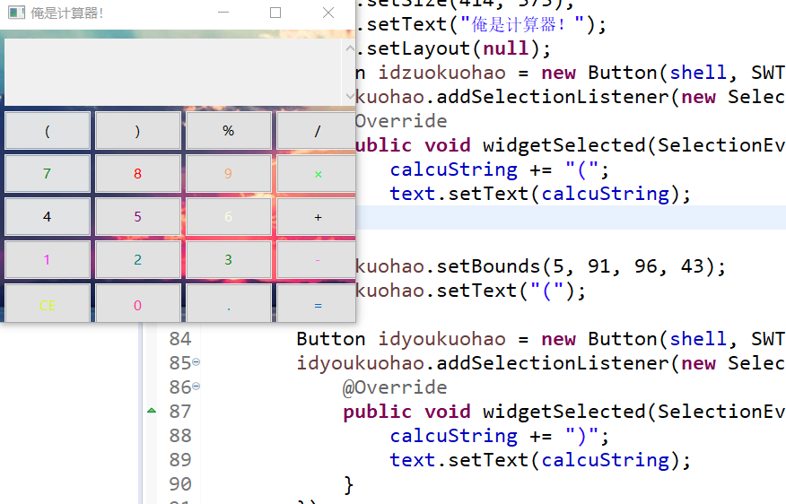
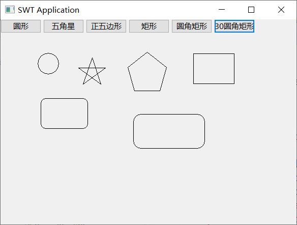

## Java小项目
---
一些在学习Java的时候写的东西

---

### 计算器
- 实现的效果大概是这样:
  

支持简单的运算,内部使用eval实现！（当然Java没有eval，但是Java内封装了JavaScript，所以可以用JavaScript的eval函数） 

- 源代码:
```java
package Calculator;

import org.eclipse.swt.widgets.Display;
import org.eclipse.swt.widgets.Shell;
import org.eclipse.swt.layout.FillLayout;

import java.awt.event.KeyAdapter;

import javax.script.ScriptEngine;
import javax.script.ScriptEngineManager;
import javax.script.ScriptException;

import org.eclipse.swt.SWT;
import org.eclipse.swt.widgets.Button;
import org.eclipse.swt.widgets.Table;
import org.eclipse.swt.widgets.Label;
import org.eclipse.swt.widgets.List;
import org.eclipse.swt.layout.GridLayout;
import org.eclipse.swt.layout.GridData;
import org.eclipse.swt.events.KeyEvent;
import org.eclipse.swt.events.KeyListener;
import org.eclipse.swt.events.SelectionAdapter;
import org.eclipse.swt.events.SelectionEvent;
import org.eclipse.swt.graphics.Image;
import org.eclipse.wb.swt.SWTResourceManager;
import org.eclipse.swt.widgets.Text;

public class Calculator {
	protected String calcuString = "";
	static ScriptEngine jse = new ScriptEngineManager().getEngineByName("JavaScript");
	protected Shell shell;
	private Text text;

	/**
	 * Launch the application.
	 * 
	 * @param args
	 */
	public static void main(String[] args) {
		try {
			Calculator window = new Calculator();
			window.open();
		} catch (Exception e) {
			e.printStackTrace();
		}
	}

	/**
	 * Open the window.
	 */
	public void open() {
		Display display = Display.getDefault();
		createContents();
		shell.open();
		shell.layout();
		while (!shell.isDisposed()) {
			if (!display.readAndDispatch()) {
				display.sleep();
			}
		}
	}

	/**
	 * Create contents of the window.
	 */
	protected void createContents() {
		shell = new Shell();
		Image image=SWTResourceManager.getImage(Calculator.class,"ss.png");
		shell.setBackgroundImage(image);
		shell.setSize(414, 373);
		shell.setText("俺是计算器！");
		shell.setLayout(null);
		Button idzuokuohao = new Button(shell, SWT.NONE);
		idzuokuohao.addSelectionListener(new SelectionAdapter() {
			@Override
			public void widgetSelected(SelectionEvent e) {
				calcuString += "(";
				text.setText(calcuString);
			}
		});
		idzuokuohao.setBounds(5, 91, 96, 43);
		idzuokuohao.setText("(");

		Button idyoukuohao = new Button(shell, SWT.NONE);
		idyoukuohao.addSelectionListener(new SelectionAdapter() {
			@Override
			public void widgetSelected(SelectionEvent e) {
				calcuString += ")";
				text.setText(calcuString);
			}
		});
		idyoukuohao.setBounds(106, 91, 96, 43);
		idyoukuohao.setText(")");

		Button idquyu = new Button(shell, SWT.NONE);
		idquyu.addSelectionListener(new SelectionAdapter() {
			@Override
			public void widgetSelected(SelectionEvent e) {
				calcuString += "%";
				text.setText(calcuString);
			}
		});
		idquyu.setBounds(207, 91, 96, 43);
		idquyu.setText("%");

		Button idchu = new Button(shell, SWT.NONE);
		idchu.addSelectionListener(new SelectionAdapter() {
			@Override
			public void widgetSelected(SelectionEvent e) {
				calcuString += "/";
				text.setText(calcuString);
			}
		});
		idchu.setBounds(308, 91, 93, 43);
		idchu.setText("/");

		Button id7 = new Button(shell, SWT.NONE);
		id7.setForeground(SWTResourceManager.getColor(SWT.COLOR_DARK_GREEN));
		id7.addSelectionListener(new SelectionAdapter() {
			@Override
			public void widgetSelected(SelectionEvent e) {
				calcuString += "7";
				text.setText(calcuString);
			}
		});
		id7.setBounds(5, 139, 96, 43);
		id7.setText("7");

		Button id8 = new Button(shell, SWT.NONE);
		id8.setForeground(SWTResourceManager.getColor(SWT.COLOR_RED));
		id8.addSelectionListener(new SelectionAdapter() {
			@Override
			public void widgetSelected(SelectionEvent e) {
				calcuString += "8";
				text.setText(calcuString);
			}
		});
		id8.setBounds(106, 139, 96, 43);
		id8.setText("8");

		Button id9 = new Button(shell, SWT.NONE);
		id9.setForeground(SWTResourceManager.getColor(244, 164, 96));
		id9.addSelectionListener(new SelectionAdapter() {
			@Override
			public void widgetSelected(SelectionEvent e) {
				calcuString += "9";
				text.setText(calcuString);
			}
		});
		id9.setBounds(207, 139, 96, 43);
		id9.setText("9");

		Button idcheng = new Button(shell, SWT.NONE);
		idcheng.setForeground(SWTResourceManager.getColor(0, 255, 51));
		idcheng.addSelectionListener(new SelectionAdapter() {
			@Override
			public void widgetSelected(SelectionEvent e) {
				calcuString += "*";
				text.setText(calcuString);
			}
		});
		idcheng.setBounds(308, 139, 93, 43);
		idcheng.setText("×");

		Button id4 = new Button(shell, SWT.NONE);
		id4.addSelectionListener(new SelectionAdapter() {
			@Override
			public void widgetSelected(SelectionEvent e) {
				calcuString += "4";
				text.setText(calcuString);
			}
		});
		id4.setBounds(5, 187, 96, 43);
		id4.setText("4");

		Button id5 = new Button(shell, SWT.NONE);
		id5.setForeground(SWTResourceManager.getColor(SWT.COLOR_DARK_MAGENTA));
		id5.addSelectionListener(new SelectionAdapter() {
			@Override
			public void widgetSelected(SelectionEvent e) {
				calcuString += "5";
				text.setText(calcuString);
			}
		});
		id5.setBounds(106, 187, 96, 43);
		id5.setText("5");

		Button id6 = new Button(shell, SWT.NONE);
		id6.setForeground(SWTResourceManager.getColor(SWT.COLOR_INFO_BACKGROUND));
		id6.addSelectionListener(new SelectionAdapter() {
			@Override
			public void widgetSelected(SelectionEvent e) {
				calcuString += "6";
				text.setText(calcuString);
			}
		});
		id6.setBounds(207, 187, 96, 43);
		id6.setText("6");

		Button idjia = new Button(shell, SWT.NONE);
		idjia.addSelectionListener(new SelectionAdapter() {
			@Override
			public void widgetSelected(SelectionEvent e) {
				calcuString += "+";
				text.setText(calcuString);
			}
		});
		idjia.setBounds(308, 187, 93, 43);
		idjia.setText("+");

		Button id1 = new Button(shell, SWT.NONE);
		id1.setForeground(SWTResourceManager.getColor(SWT.COLOR_MAGENTA));
		id1.addSelectionListener(new SelectionAdapter() {
			@Override
			public void widgetSelected(SelectionEvent e) {
				calcuString += "1";
				text.setText(calcuString);
			}
		});
		id1.setBounds(5, 235, 96, 43);
		id1.setText("1");

		Button id2 = new Button(shell, SWT.NONE);
		id2.setForeground(SWTResourceManager.getColor(SWT.COLOR_DARK_CYAN));
		id2.addSelectionListener(new SelectionAdapter() {
			@Override
			public void widgetSelected(SelectionEvent e) {
				calcuString += "2";
				text.setText(calcuString);
			}
		});
		id2.setBounds(106, 235, 96, 43);
		id2.setText("2");

		Button id3 = new Button(shell, SWT.NONE);
		id3.setForeground(SWTResourceManager.getColor(SWT.COLOR_DARK_GREEN));
		id3.addSelectionListener(new SelectionAdapter() {
			@Override
			public void widgetSelected(SelectionEvent e) {
				calcuString += "3";
				text.setText(calcuString);
			}
		});
		id3.setBounds(207, 235, 96, 43);
		id3.setText("3");

		Button idjian = new Button(shell, SWT.NONE);
		idjian.setForeground(SWTResourceManager.getColor(255, 102, 255));
		idjian.addSelectionListener(new SelectionAdapter() {
			@Override
			public void widgetSelected(SelectionEvent e) {
				calcuString += "-";
				text.setText(calcuString);
			}
		});
		idjian.setBounds(308, 235, 93, 43);
		idjian.setText("-");

		Button idce = new Button(shell, SWT.NONE);
		idce.setForeground(SWTResourceManager.getColor(204, 255, 0));
		idce.addSelectionListener(new SelectionAdapter() {
			@Override
			public void widgetSelected(SelectionEvent e) {
				calcuString = "";
				text.setText(calcuString);
			}
		});
		idce.setBounds(5, 283, 96, 48);
		idce.setText("CE");

		Button id0 = new Button(shell, SWT.NONE);
		id0.addSelectionListener(new SelectionAdapter() {
			@Override
			public void widgetSelected(SelectionEvent e) {
				calcuString += "0";
				text.setText(calcuString);
			}
		});
		id0.setForeground(SWTResourceManager.getColor(255, 51, 153));
		id0.setBounds(106, 283, 96, 48);
		id0.setText("0");

		Button iddian = new Button(shell, SWT.NONE);
		iddian.setForeground(SWTResourceManager.getColor(0, 153, 204));
		iddian.addSelectionListener(new SelectionAdapter() {
			@Override
			public void widgetSelected(SelectionEvent e) {
				calcuString += ".";
				text.setText(calcuString);
			}
		});
		iddian.setBounds(207, 283, 96, 48);
		iddian.setText(".");

		Button idDengyu = new Button(shell, SWT.NONE);
		idDengyu.setForeground(SWTResourceManager.getColor(SWT.COLOR_LINK_FOREGROUND));
		idDengyu.addSelectionListener(new SelectionAdapter() {
			@Override
			public void widgetSelected(SelectionEvent e) {
				try {
					Object aa = jse.eval(calcuString);
					text.setText(calcuString + "=" + aa);
				} catch (ScriptException e1) {
					text.setText("输入的表达式有错误，检查一下吧！");
					calcuString = "";
				}
			}
		});
		idDengyu.setBounds(308, 283, 93, 48);
		idDengyu.setText("=");

		text = new Text(shell, SWT.WRAP | SWT.V_SCROLL | SWT.READ_ONLY);
		text.setFont(SWTResourceManager.getFont("Microsoft YaHei UI", 16, SWT.NORMAL));
		text.setBounds(5, 10, 396, 75);

	}
}
``` 

### 画图形的AWT部分代码
----
能够画，虽然没有什么用-.-。

---

实现效果:


源代码比较多，就直接沾上word文件吧！
- 其中使用到了反射及搜索包下的所有类的方法，具体实现不是俺写的，是引用的别的大佬写的文件。-.-其实我觉的使用File方法也能写。算了等一会写一个吧！

源代码:
```java
ClassUtil.java
package draw;

import java.io.File;
import java.io.FileFilter;
import java.io.IOException;
import java.lang.annotation.Annotation;
import java.net.JarURLConnection;
import java.net.URL;
import java.util.ArrayList;
import java.util.Enumeration;
import java.util.List;
import java.util.jar.JarEntry;
import java.util.jar.JarFile;

public class ClassUtil {
	public static List<Class<?>> getClassList(String pkgName , boolean isRecursive, Class<? extends Annotation> annotation) {
		List<Class<?>> classList = new ArrayList<Class<?>>();
		ClassLoader loader = Thread.currentThread().getContextClassLoader();
		try {
			String strFile = pkgName.replaceAll("\\.", "/");
			Enumeration<URL> urls = loader.getResources(strFile);
			while (urls.hasMoreElements()) {
				URL url = urls.nextElement();
                if (url != null) {
                	String protocol = url.getProtocol();
                	String pkgPath = url.getPath();
                	System.out.println("protocol:" + protocol +" path:" + pkgPath);
                    if ("file".equals(protocol)) {
                    	// 本地自己可见的代码
						findClassName(classList, pkgName, pkgPath, isRecursive, annotation);
					} else if ("jar".equals(protocol)) {
                    	// 引用第三方jar的代码
						findClassName(classList, pkgName, url, isRecursive, annotation);
                    }
                }
			}
		} catch (IOException e) {
			e.printStackTrace();
		}
		
		return classList;
	}
	
	public static  void findClassName(List<Class<?>> clazzList, String pkgName, String pkgPath, boolean isRecursive, Class<? extends Annotation> annotation) {
		if(clazzList == null){
			return;
		}
		File[] files = filterClassFiles(pkgPath);// 过滤出.class文件及文件夹
		System.out.println("files:" +((files == null)?"null" : "length=" + files.length));
		if(files != null){
			for (File f : files) {
				String fileName = f.getName();
				if (f.isFile()) {
					// .class 文件的情况
					String clazzName = getClassName(pkgName, fileName);
					addClassName(clazzList, clazzName, annotation);
				} else {
					// 文件夹的情况
					if(isRecursive){
						// 需要继续查找该文件夹/包名下的类
						String subPkgName = pkgName +"."+ fileName;
						String subPkgPath = pkgPath +"/"+ fileName;
						findClassName(clazzList, subPkgName, subPkgPath, true, annotation);
					}
				}
			}
		}
	}
	
	/**
	 * 第三方Jar类库的引用。<br/>
	 * @throws IOException 
	 * */
	public static  void findClassName(List<Class<?>> clazzList, String pkgName, URL url, boolean isRecursive, Class<? extends Annotation> annotation) throws IOException {
		JarURLConnection jarURLConnection = (JarURLConnection) url.openConnection();
		JarFile jarFile = jarURLConnection.getJarFile();
		System.out.println("jarFile:" + jarFile.getName());
		Enumeration<JarEntry> jarEntries = jarFile.entries();
		while (jarEntries.hasMoreElements()) {
			JarEntry jarEntry = jarEntries.nextElement();
			String jarEntryName = jarEntry.getName(); // 类似：sun/security/internal/interfaces/TlsMasterSecret.class
			String clazzName = jarEntryName.replace("/", ".");
			int endIndex = clazzName.lastIndexOf(".");
			String prefix = null;
			if (endIndex > 0) {
				String prefix_name = clazzName.substring(0, endIndex);
				endIndex = prefix_name.lastIndexOf(".");
				if(endIndex > 0){
					prefix = prefix_name.substring(0, endIndex);
				}
			}
			if (prefix != null && jarEntryName.endsWith(".class")) {
//				System.out.println("prefix:" + prefix +" pkgName:" + pkgName);
				if(prefix.equals(pkgName)){
					System.out.println("jar entryName:" + jarEntryName);
					addClassName(clazzList, clazzName, annotation);
				} else if(isRecursive && prefix.startsWith(pkgName)){
					// 遍历子包名：子类
					System.out.println("jar entryName:" + jarEntryName +" isRecursive:" + isRecursive);
					addClassName(clazzList, clazzName, annotation);
				}
			}
		}
	}
	
	private static File[] filterClassFiles(String pkgPath) {
		if(pkgPath == null){
			return null;
		}
		// 接收 .class 文件 或 类文件夹
		return new File(pkgPath).listFiles(new FileFilter() {
			@Override
			public boolean accept(File file) {
				return (file.isFile() && file.getName().endsWith(".class")) || file.isDirectory();
			}
		});
    }
	
	private static String getClassName(String pkgName, String fileName) {
		int endIndex = fileName.lastIndexOf(".");
		String clazz = null;
		if (endIndex >= 0) {
			clazz = fileName.substring(0, endIndex);
		}
		String clazzName = null;
		if (clazz != null) {
			clazzName = pkgName + "." + clazz;
		}
		return clazzName;
	}
	
	private static void addClassName(List<Class<?>> clazzList, String clazzName, Class<? extends Annotation> annotation) {
		if (clazzList != null && clazzName != null) {
			Class<?> clazz = null;
			try {
				clazz = Class.forName(clazzName);
			} catch (ClassNotFoundException e) {
				e.printStackTrace();
			}
//			System.out.println("isAnnotation=" + clazz.isAnnotation() +" author:" + clazz.isAnnotationPresent(author.class));
			
			if (clazz != null) {
				if(annotation == null){
					clazzList.add(clazz);
					System.out.println("add:" + clazz);
				} else if (clazz.isAnnotationPresent(annotation)){
					clazzList.add(clazz);
					System.out.println("add annotation:" + clazz);
				}
			}
		}
	}
}
Main.java
package draw;

import org.eclipse.swt.widgets.Display;
import org.eclipse.swt.widgets.Shell;
import org.eclipse.ui.actions.SimpleWildcardTester;

import shape.Board;
import shape.Circle;
import shape.Rect;
import shape.Shape;

import java.lang.reflect.Constructor;
import java.lang.reflect.Method;
import java.util.ArrayList;
import java.util.List;

import org.eclipse.swt.SWT;
import org.eclipse.swt.events.MouseAdapter;
import org.eclipse.swt.events.MouseEvent;
import org.eclipse.swt.events.PaintEvent;
import org.eclipse.swt.events.PaintListener;
import org.eclipse.swt.graphics.Cursor;
import org.eclipse.swt.graphics.GC;
import org.eclipse.swt.events.MouseMoveListener;
import org.eclipse.swt.widgets.Button;
import org.eclipse.swt.events.SelectionAdapter;
import org.eclipse.swt.events.SelectionEvent;
import org.eclipse.swt.events.SelectionListener;

public class Main {

	private static GC gcMainGc=null;
	private Board board;
	protected Shell shell;
	private int startx;
	private int starty;
	private boolean leftDown = false;
	private static String shapeType = "shape.Rect";
	private static List<String>shapeTypes=null;
	private int lastw = 0;
	private int lasth = 0;

	/**
	 * Launch the application.
	 * 
	 * @param args
	 */
	public static void main(String[] args) {
			
		try {
			List listClass=null;
			String pkgString="shape";
			listClass=  ClassUtil.getClassList(pkgString, true, null);
			shapeTypes=new ArrayList<String>();
			for (Object object:listClass) {
				String nameString=((Class<?>)object).getName();
				if (!(nameString.equals("shape.Shape")||(nameString.equals("shape.Board")))) {
					shapeTypes.add(nameString);
				}
			}
			Main window = new Main();
			window.open();
		} catch (Exception e) {
			e.printStackTrace();
		}
		
	}

	/**
	 * Open the window.
	 */
	public void open() {
		Display display = Display.getDefault();
		createContents();
		shell.open();
		shell.layout();
		//////////////////////////////////////////
		int indexButton=0;
		for (String strclass:shapeTypes) {
			Button button=new Button(shell, SWT.NONE);
			button.addSelectionListener(new SelectionAdapter() {
				@Override
				public void widgetSelected(SelectionEvent e)
				{
					shapeType=strclass;
				}
			});
			button.setBounds(84*indexButton,0,80,27);
			indexButton++;
			try {
				Class<?> shapeClass=Class.forName(strclass);
				Method method=shapeClass.getMethod("getText");
				button.setText(method.invoke(null, null).toString());
				button.setData("shapeType",strclass);
			}catch (Exception e) {
				// TODO: handle exception
				button.setText(strclass);
				button.setData("shapeType",strclass);
			}
		}
		//////////////////////////////////////////
		
		while (!shell.isDisposed()) {
			if (!display.readAndDispatch()) {
				display.sleep();
			}
		}
	
	}

	/**
	 * Create contents of the window.
	 */
	protected void createContents() {
		shell = new Shell();
		Display display = Display.getDefault();
		GC gcMain = new GC(shell);
		board = new Board();

		shell.addPaintListener(new PaintListener() {

			@Override
			public void paintControl(PaintEvent arg0) {
				board.refresh();
			}
		});

		shell.addMouseMoveListener(new MouseMoveListener() {
			public void mouseMove(MouseEvent arg0) {
				if (leftDown) {
					gcMain.setLineStyle(SWT.LINE_DOT);
					gcMain.setForeground(shell.getBackground());
					gcMain.drawRectangle(startx, starty, lastw, lasth);
					gcMain.setForeground(display.getSystemColor(SWT.COLOR_BLUE));
					gcMain.drawRectangle(startx, starty, arg0.x - startx, arg0.y - starty);
					lastw = arg0.x - startx;
					lasth = arg0.y - starty;
					gcMain.setLineStyle(SWT.LINE_SOLID);
					gcMain.setForeground(display.getSystemColor(SWT.COLOR_BLACK));
				}
			}
		});
		shell.addMouseListener(new MouseAdapter() {
			@Override
			public void mouseDown(MouseEvent e) {
				shell.setCursor(new Cursor(null, SWT.CURSOR_CROSS));
				leftDown = true;
				startx = e.x;
				starty = e.y;

			}

			@Override
			public void mouseUp(MouseEvent e) {
				leftDown = false;
				if (e.button != 1) {
				} else {
					shell.setCursor(new Cursor(null, SWT.CURSOR_ARROW));
					gcMain.setLineStyle(SWT.LINE_DOT);
					gcMain.setForeground(shell.getBackground());
					gcMain.drawRectangle(startx, starty, lastw, lasth);
					gcMain.setLineStyle(SWT.LINE_SOLID);
					gcMain.setForeground(display.getSystemColor(SWT.COLOR_BLACK));
					Shape shape;
					try {
						Class shapeClass = Class.forName(shapeType);
						Constructor<?> constructor=shapeClass.getConstructor(
								int.class,int.class,int.class,int.class,GC.class);
						Object shapeObject = constructor.newInstance(startx,starty,e.x
								- startx,e.y - starty,gcMain);
						shape = (Shape) shapeObject;
						shape.draw();
						board.insertShape(shape);
						board.refresh();
					}catch (Exception x2) {
						x2.printStackTrace();
					}	
				}
			}
		});
		shell.setSize(600, 450);
		shell.setText("SWT Application");

	}
}
Shpee包
Board.java
package shape;

import java.util.ArrayList;
import java.util.List;

import shape.Shape;

public class Board {
	private List<Shape> shapes;

	public Board() {
		shapes = new ArrayList<Shape>();
	}

	public void insertShape(Shape shape) {
		shapes.add(shape);
	}

	public void refresh() {
		for (Shape s : shapes) {
			s.draw();
		}
	}
}
Circle.java
package shape;

import org.eclipse.swt.graphics.GC;

public class Circle implements Shape {

	private int top;
	private int left;
	private int weight;
	private int height;
	private GC gcMain;
	
	
	public static String getText() {
		return "圆形";
	}
	
	public Circle() {
	}

	public Circle(int top, int left, int weight, int height, GC gcMain) {
        this.top = top;
        this.left = left;
        this.weight = weight;
        this.height = height;
        this.gcMain = gcMain;
    }
	
	public int getTop() {
		return top;
	}

	public void setTop(int top) {
		this.top = top;
	}

	public int getLeft() {
		return left;
	}

	public void setLeft(int left) {
		this.left = left;
	}


	public int getWeight() {
		return weight;
	}

	public void setWeight(int weight) {
		this.weight = weight;
	}

	public int getHeight() {
		return height;
	}

	public void setHeight(int height) {
		this.height = height;
	}

	public GC getGcMain() {
		return gcMain;
	}

	public void setGcMain(GC gcMain) {
		this.gcMain = gcMain;
	}

	@Override
	public void draw() {
		// TODO Auto-generated method stub
		gcMain.drawOval(top,left,weight,height);
	}

}
Pentagram.java
package shape;

import org.eclipse.swt.graphics.GC;

public class Pentagram implements Shape {

	private int top;
	

	private int left;
	private int weight;
	private int height;
	private GC gcMain;
	
	public Pentagram(int top, int left, int weight, int height, GC gcMain) {
		super();
		this.top = top;
		this.left = left;
		this.weight = weight;
		this.height = height;
		this.gcMain = gcMain;
	}
	
	public int getTop() {
		return top;
	}
	public void setTop(int top) {
		this.top = top;
	}
	public int getLeft() {
		return left;
	}
	public void setLeft(int left) {
		this.left = left;
	}
	public int getWeight() {
		return weight;
	}
	public void setWeight(int weight) {
		this.weight = weight;
	}
	public int getHeight() {
		return height;
	}
	public void setHeight(int height) {
		this.height = height;
	}
	public GC getGcMain() {
		return gcMain;
	}
	public void setGcMain(GC gcMain) {
		this.gcMain = gcMain;
	}
	public static String getText() {
		return "五角星";
	}
	
	@Override
	public void draw() {
		float x1,y1,x2,y2,x3,y3,x4,y4,x5,y5, w;
        w = (float)weight/2;
        double sin72 = 0.9510565163;
        double cos72 = 0.3090169944;
        double cos54 = 0.5877852523;
        double sin54 = 0.8090169944;
        int x = top;
        int y = left;
        x1 = (float)w + x;
        y1 = (float)y;
        x2 = (float)(x + (w - (w * sin72 * sin72)));
        System.out.println("x2 = " + x2);
        y2 = (float)(y + (w - (w * sin72 * cos72)));
        x3 = (float)(x + w + (w * sin72 * sin72));
        y3 = y2;
        x4 = (float)(x + (w - (w * cos54)));
        y4 = (float)(y + w + w * sin54);
        x5 = (float)(x + w + (w * cos54));
        y5 = y4;
        gcMain.drawLine((int)x1,(int)y1,(int) x4,(int) y4);
        gcMain.drawLine((int)x1,(int)y1,(int) x5,(int) y5);
        gcMain.drawLine((int)x2,(int)y2,(int) x3,(int) y3);
        gcMain.drawLine((int)x2,(int)y2,(int) x5,(int) y5);
        gcMain.drawLine((int)x3,(int)y3,(int) x4,(int) y4);

//		}
		
	}
	
}
Positivepentagon.java
package shape;


import org.eclipse.swt.graphics.GC;

public class Positivepentagon implements Shape {
	private int top;
	private int left;
	private int weight;
	private int height;
	private GC gcMain;
	
	public Positivepentagon(int top, int left, int weight, int height, GC gcMain) {
		super();
		this.top = top;
		this.left = left;
		this.weight = weight;
		this.height = height;
		this.gcMain = gcMain;
	}
	public int getTop() {
		return top;
	}
	public void setTop(int top) {
		this.top = top;
	}
	public int getLeft() {
		return left;
	}
	public void setLeft(int left) {
		this.left = left;
	}
	public int getWeight() {
		return weight;
	}
	public void setWeight(int weight) {
		this.weight = weight;
	}
	public int getHeight() {
		return height;
	}
	public void setHeight(int height) {
		this.height = height;
	}
	public GC getGcMain() {
		return gcMain;
	}
	public void setGcMain(GC gcMain) {
		this.gcMain = gcMain;
	}
	public static String getText() {
		return "正五边形";
	}
	
	@Override
	public void draw() {
        float x1,y1,x2,y2,x3,y3,x4,y4,x5,y5, w;
        w = (float)weight/2;
        double sin72 = 0.9510565163;
        double cos72 = 0.3090169944;
        double cos54 = 0.5877852523;
        double sin54 = 0.8090169944;
        int x = top;
        int y = left;
        x1 = (float)w + x;
        y1 = (float)y;
        x2 = (float)(x + (w - (w * sin72 * sin72)));
        System.out.println("x2 = " + x2);
        y2 = (float)(y + (w - (w * sin72 * cos72)));
        x3 = (float)(x + w + (w * sin72 * sin72));
        y3 = y2;
        x4 = (float)(x + (w - (w * cos54)));
        y4 = (float)(y + w + w * sin54);
        x5 = (float)(x + w + (w * cos54));
        y5 = y4;
        gcMain.drawLine((int)x1,(int)y1,(int) x2,(int) y2);
        gcMain.drawLine((int)x1,(int)y1,(int) x3,(int) y3);
        gcMain.drawLine((int)x2,(int)y2,(int) x4,(int) y4);
        gcMain.drawLine((int)x4,(int)y4,(int) x5,(int) y5);
        gcMain.drawLine((int)x5,(int)y5,(int) x3,(int) y3);
	}
}
Rect.java
package shape;

import org.eclipse.swt.graphics.GC;

public class Rect  implements Shape{

	private int top;
	private int left;
	private int weight;
	private int height;
	private GC gcMain;
	
	
	public static String getText() {
		return "矩形";
	}
	
    public Rect() {
	}


	public Rect(int top, int left, int weight, int height, GC gcMain) {
        this.top = top;
        this.left = left;
        this.weight = weight;
        this.height = height;
        this.gcMain = gcMain;
    }
    
	
	public int getTop() {
		return top;
	}


	public void setTop(int top) {
		this.top = top;
	}


	public int getLeft() {
		return left;
	}


	public void setLeft(int left) {
		this.left = left;
	}


	public int getWeight() {
		return weight;
	}


	public void setWeight(int weight) {
		this.weight = weight;
	}


	public int getHeight() {
		return height;
	}


	public void setHeight(int height) {
		this.height = height;
	}


	public GC getGcMain() {
		return gcMain;
	}


	public void setGcMain(GC gcMain) {
		this.gcMain = gcMain;
	}


	@Override
	public void draw() {
		gcMain.drawRectangle(top,left,weight,height);
	}

}
RoundRect.java
package shape;

import org.eclipse.swt.graphics.GC;

public class RoundRect implements Shape {

	private int top;
	private int left;
	private int weight;
	private int height;
	private GC gcMain;
	
	
	public RoundRect(int top, int left, int weight, int height, GC gcMain) {
		super();
		this.top = top;
		this.left = left;
		this.weight = weight;
		this.height = height;
		this.gcMain = gcMain;
	}
	public int getTop() {
		return top;
	}
	public void setTop(int top) {
		this.top = top;
	}
	public int getLeft() {
		return left;
	}
	public void setLeft(int left) {
		this.left = left;
	}
	public int getWeight() {
		return weight;
	}
	public void setWeight(int weight) {
		this.weight = weight;
	}
	public int getHeight() {
		return height;
	}
	public void setHeight(int height) {
		this.height = height;
	}
	public GC getGcMain() {
		return gcMain;
	}
	public void setGcMain(GC gcMain) {
		this.gcMain = gcMain;
	}
	public static String getText() {
		return "圆角矩形";
	}
	
	@Override
	public void draw() {
		// TODO Auto-generated method stub
		gcMain.drawRoundRectangle(top, left, weight, height, 20, 20);
	}
	
	
	
}
RoundRect30.java
package shape;

import org.eclipse.swt.graphics.GC;

public class RoundRect30 implements Shape {

	private int top;
	private int left;
	private int weight;
	private int height;
	private GC gcMain;
	
	
	public RoundRect30(int top, int left, int weight, int height, GC gcMain) {
		super();
		this.top = top;
		this.left = left;
		this.weight = weight;
		this.height = height;
		this.gcMain = gcMain;
	}
	public int getTop() {
		return top;
	}
	public void setTop(int top) {
		this.top = top;
	}
	public int getLeft() {
		return left;
	}
	public void setLeft(int left) {
		this.left = left;
	}
	public int getWeight() {
		return weight;
	}
	public void setWeight(int weight) {
		this.weight = weight;
	}
	public int getHeight() {
		return height;
	}
	public void setHeight(int height) {
		this.height = height;
	}
	public GC getGcMain() {
		return gcMain;
	}
	public void setGcMain(GC gcMain) {
		this.gcMain = gcMain;
	}
	public static String getText() {
		return "30圆角矩形";
	}
	
	@Override
	public void draw() {
		// TODO Auto-generated method stub
		gcMain.drawRoundRectangle(top, left, weight, height,30,30);
	}
}
Shape.java
package shape;

import org.eclipse.swt.graphics.GC;

public interface Shape {
	public void draw();
	public void setTop(int top);
	public void setLeft(int left);
	public void setWeight(int weight);
	public void setHeight(int height);
	public void setGcMain(GC gcMain);
}
```