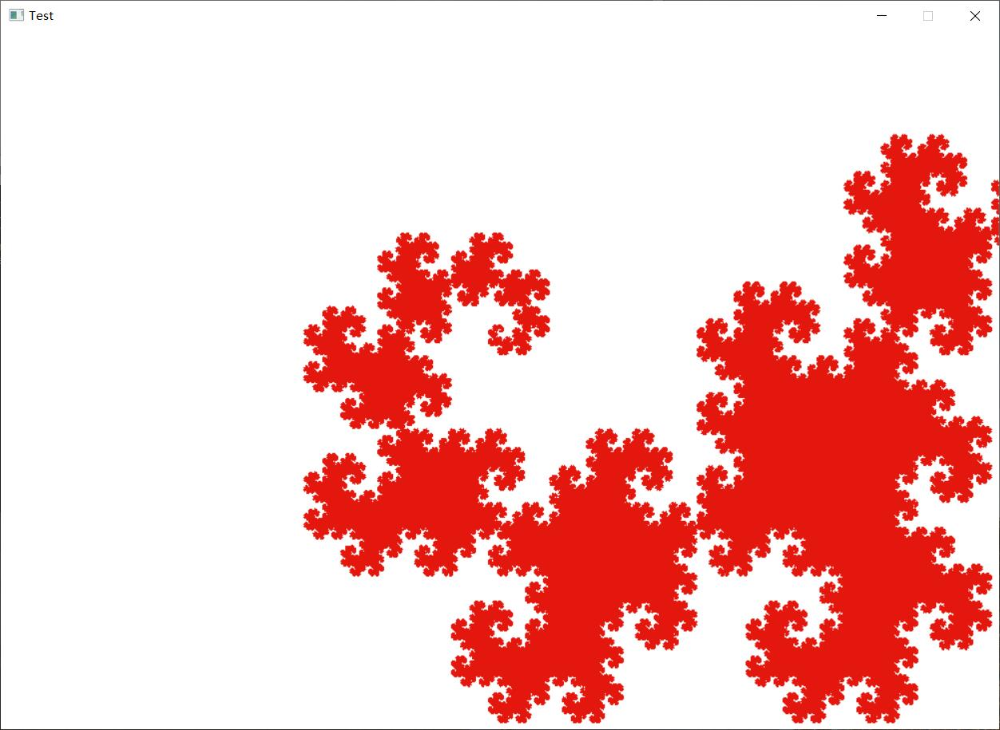

### 本文件内包含日常做的一些小应用以及课程设计文件（转载请注明出处）
- #### 哈夫曼编码译码器
### [哈夫曼编码译码器](https://github.com/kklll/course-project)
- 有可视化，请自行查阅


### [算法课设-龙曲线](../project/龙曲线/main.cpp)
- 项目使用c++图形库EasyX实现，也可以使用python的乌龟库绘图库

效果如图：（演示为第24代龙曲线，由于是指数型增长，电脑跑到这一代已经快遭不住了，缩放因子很大，看着图片很小，但是其字符串长度为 50331647）


### [小程序，有关日期计算](https://github.com/kklll/StudyNode/blob/master/Project2/bighomework.c)

本程序没有调库，所有的时间计算都是手写。
```c++
	printf("本程序有6个功能：\n");
	printf("1:输出月历\n");
	printf("2:输入任意年月日，计算这一天是这一年的第几天\n");
	printf("3:输入任意年月日，计算这一天为星期几\n");
	printf("4:输入任意年月日，计算这一天为农历几月几日（支持1901--2099年）\n");
	printf("5:输入任意年月日，输出最近的节假日及间隔天数\n");
	printf("6:输入某个人的生日，输出年（天）龄\n");
```
