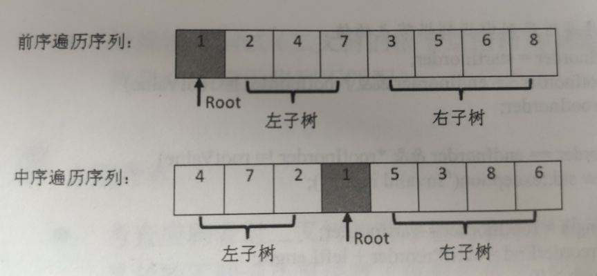

<!--961032830987546d0e6d54829fc886f6-->

### 2021年前来填坑，后续的代码都会放在算法\studydemo\algorithm\src\main\java\com\kklll\learn\algorithm中，需要的小伙伴请自己食用！  --最近更新时间，2021年2月
目录(Catalo)

*
    * [盛最多水的容器](#%E7%9B%9B%E6%9C%80%E5%A4%9A%E6%B0%B4%E7%9A%84%E5%AE%B9%E5%99%A8)
    * [二叉树的层平均值](#%E4%BA%8C%E5%8F%89%E6%A0%91%E7%9A%84%E5%B1%82%E5%B9%B3%E5%9D%87%E5%80%BC)
    * [计算x的n次幂函数](#%E8%AE%A1%E7%AE%97x%E7%9A%84n%E6%AC%A1%E5%B9%82%E5%87%BD%E6%95%B0)
    * [找数字](#%E6%89%BE%E6%95%B0%E5%AD%97)
    * [只出现一次的数字](#%E5%8F%AA%E5%87%BA%E7%8E%B0%E4%B8%80%E6%AC%A1%E7%9A%84%E6%95%B0%E5%AD%97)
    * [求众数](#%E6%B1%82%E4%BC%97%E6%95%B0)
    * [删除排序数组中的重复项](#%E5%88%A0%E9%99%A4%E6%8E%92%E5%BA%8F%E6%95%B0%E7%BB%84%E4%B8%AD%E7%9A%84%E9%87%8D%E5%A4%8D%E9%A1%B9)
    * [最长公共前缀](#%E6%9C%80%E9%95%BF%E5%85%AC%E5%85%B1%E5%89%8D%E7%BC%80)
    * [寻找两个有序数组的中位数](#%E5%AF%BB%E6%89%BE%E4%B8%A4%E4%B8%AA%E6%9C%89%E5%BA%8F%E6%95%B0%E7%BB%84%E7%9A%84%E4%B8%AD%E4%BD%8D%E6%95%B0)
    * [三种方法解决背包问题](#%E4%B8%89%E7%A7%8D%E6%96%B9%E6%B3%95%E8%A7%A3%E5%86%B3%E8%83%8C%E5%8C%85%E9%97%AE%E9%A2%98)
    * [链表联合](#%E9%93%BE%E8%A1%A8%E8%81%94%E5%90%88)
    * [山羊拉丁文](#%E5%B1%B1%E7%BE%8A%E6%8B%89%E4%B8%81%E6%96%87)
    * [二叉树排序](#%E4%BA%8C%E5%8F%89%E6%A0%91%E6%8E%92%E5%BA%8F)
    * [123](#123)
    * [三角形最小路径和](#%E4%B8%89%E8%A7%92%E5%BD%A2%E6%9C%80%E5%B0%8F%E8%B7%AF%E5%BE%84%E5%92%8C)
    * [在排序数组中查找元素的第一个和最后一个位置](#%E5%9C%A8%E6%8E%92%E5%BA%8F%E6%95%B0%E7%BB%84%E4%B8%AD%E6%9F%A5%E6%89%BE%E5%85%83%E7%B4%A0%E7%9A%84%E7%AC%AC%E4%B8%80%E4%B8%AA%E5%92%8C%E6%9C%80%E5%90%8E%E4%B8%80%E4%B8%AA%E4%BD%8D%E7%BD%AE)
    * [删除链表的倒数第N个节点](#%E5%88%A0%E9%99%A4%E9%93%BE%E8%A1%A8%E7%9A%84%E5%80%92%E6%95%B0%E7%AC%ACN%E4%B8%AA%E8%8A%82%E7%82%B9)
    * [二叉树中所有距离为K的结点](#%E4%BA%8C%E5%8F%89%E6%A0%91%E4%B8%AD%E6%89%80%E6%9C%89%E8%B7%9D%E7%A6%BB%E4%B8%BAK%E7%9A%84%E7%BB%93%E7%82%B9)
<!--a46263f7a69f33f39fc26f907cdb773a-->
### 盛最多水的容器
```给定 n 个非负整数 a1，a2，...，an，每个数代表坐标中的一个点 (i, ai) 。在坐标内画 n 条垂直线，垂直线 i 的两个端点分别为 (i, ai) 和 (i, 0)。找出其中的两条线，使得它们与 x 轴共同构成的容器可以容纳最多的水。

说明:你不能倾斜容器，且 n 的值至少为 2。

图中垂直线代表输入数组 [1,8,6,2,5,4,8,3,7]。在此情况下，容器能够容纳水（表示为蓝色部分）的最大值为 49。
```
 

示例:
输入: [1,8,6,2,5,4,8,3,7]
输出: 49

- 题解 

算法:
- 这种方法背后的思路在于，两线段之间形成的区域总是会受到其中较短那条长度的限制。此外，两线段距离越远，得到的面积就越大。
我们在由线段长度构成的数组中使用两个指针，一个放在开始，一个置于末尾。 此外，我们会使用变量 maxareamaxarea 来持续存储到目前为止所获得的最大面积。 在每一步中，我们会找出指针所指向的两条线段形成的区域，更新 maxareamaxarea，并将指向较短线段的指针向较长线段那端移动一步。
- 最初我们考虑由最外围两条线段构成的区域。现在，为了使面积最大化，我们需要考虑更长的两条线段之间的区域。如果我们试图将指向较长线段的指针向内侧移动，矩形区域的面积将受限于较短的线段而不会获得任何增加。但是，在同样的条件下，移动指向较短线段的指针尽管造成了矩形宽度的减小，但却可能会有助于面积的增大。因为移动较短线段的指针会得到一条相对较长的线段，这可以克服由宽度减小而引起的面积减小。
- 代码
```java
public class Solution {
    public int maxArea(int[] height) {
        int maxarea = 0, l = 0, r = height.length - 1;
        while (l < r) {
            maxarea = Math.max(maxarea, Math.min(height[l], height[r]) * (r - l));
            if (height[l] < height[r])
                l++;
            else
                r--;
        }
        return maxarea;
    }
}
```

### 二叉树的层平均值
```
输入:
    3
   / \
  9  20
    /  \
   15   7
输出: [3, 14.5, 11]
解释:
第0层的平均值是 3,  第1层是 14.5, 第2层是 11. 因此返回 [3, 14.5, 11].
```
- 解题思路:先创建队列,将头节点加入队列中，然后出队列，将头结点两端的节点加入队列中，
比如这样:


- 代码
```c++
class Solution {
public:
    vector<double> averageOfLevels(TreeNode* root) {
      queue<TreeNode*>que;
        vector<double>res;
        if(!root)return res;
        que.push(root);
        while(!que.empty()){
            int size = que.size();
            int tmp_size = size;
            double tmp = 0;
            while(size--){
                TreeNode* t = que.front();
                que.pop();
                if(t->left)que.push(t->left);
                if(t->right)que.push(t->right);
                tmp+=t->val;
            }
            res.push_back(tmp/tmp_size);
        }
        return res;
    }
};
```

### 计算x的n次幂函数

示例 
输入: 2.00000, 10
输出: 1024.00000

示例 
输入: 2.10000, 3
输出: 9.26100
- 解题思路:使用折半计算，每次把n缩小一半，这样n最终会缩小到0，任何数的0次方都为1，这时候我们再往回乘，如果此时n是偶数，直接把上次递归得到的值算个平方返回即可，如果是奇数，则还需要乘上个x的值。还有一点需要引起我们的注意的是n有可能为负数，对于n是负数的情况，我们可以先用其绝对值计算出一个结果再取其倒数即可。我们让i初始化为n，然后看i是否是2的倍数，是的话x乘以自己，否则res乘以x，i每次循环缩小一半，直到为0停止循环。最后看n的正负，如果为负，返回其倒数。


- 代码
```c++
class Solution {
    public double myPow(double x, int n) {
        double res = 1.0;
        for(int i = n; i != 0; i /= 2){
            if(i % 2 != 0){
                res *= x;
            }
            x *= x;
        }
        return  n < 0 ? 1 / res : res;
    }
}
```


### 找数字


- 解题思路:暴力就完事了。


- 代码
```c++
/**
 * Note: The returned array must be malloced, assume caller calls free().
 */
int r[2];
int* twoSum(int* nums, int numsSize, int target) {
    int i=0,j=0;
    for(i=0;i<=numsSize-2;i++)
    {
        for(j=i+1;j<=numsSize-1;j++)
        {
            if(nums[i]+nums[j]==target)
            {
                r[0]=i;
                r[1]=j;
            }
        }
    }
    return r;
}
```

### 只出现一次的数字
给定一个整数数组，除了某个元素外其余元素均出现两次。请找出这个只出现一次的元素。

备注:

你的算法应该是一个线性时间复杂度。 你可以不用额外空间来实现它吗？

- 解题思路:
刚看到题的时候计划使用哈希表，这样一次就可以检索到只出现一次的元素，在网上看到高人的代码，跪下了。
根据计算机基础可以知道:& 两者同时为真才为真
0010 0100
&
0010 0100
=
0010 0100
由以上可得知，相同数字做&运算，会得到相同的数字。
两者一者为真就为真
0010 0100
|
0010 0100
=
0010 0100
由以上可得知，相同数字做|运算，会得到相同的数字。
^ 相同为假，不同为真
0010 0100
^
0010 0100
=
0000 0000
由以上可得知，相同数字做^异或运算，会得到0。
由此延伸到题目中，可以得知，若存在一个数字只出现一次，那么该数组所有元素异或结果大于0.
--------------------- 

原文:https://blog.csdn.net/biezhihua/article/details/79571917 


- 代码
```c++
int singleNumber(int* nums, int numsSize) {
    int res=0;
    int i=0;
    for(i=0;i<numsSize;i++)
    {
        res ^= nums[i];
    }
    return res;
}
```


---


### 求众数

- 解题思路:用一种叫摩尔投票法 Moore Voting，需要O(n)的时间和O(1)的空间，这种投票法先将第一个数字假设为众数，然后把计数器设为1，比较下一个数和此数是否相等，若相等则计数器加一，反之减一。然后看此时计数器的值，若为零，则将下一个值设为候选众数。以此类推直到遍历完整个数组，当前候选众数即为该数组的众数。不仔细弄懂摩尔投票法的精髓的话，过一阵子还是会忘记的，首先要明确的是这个叼炸天的方法是有前提的，就是数组中一定要有众数的存在才能使用，下面我们来看本算法的思路，这是一种先假设候选者，然后再进行验证的算法。我们现将数组中的第一个数假设为众数，然后进行统计其出现的次数，如果遇到同样的数，则计数器自增1，否则计数器自减1，如果计数器减到了0，则更换下一个数字为候选者。这是一个很巧妙的设定，也是本算法的精髓所在，为啥遇到不同的要计数器减1呢，为啥减到0了又要更换候选者呢？首先是有那个强大的前提存在，一定会有一个出现超过半数的数字存在，那么如果计数器减到0了话，说明目前不是候选者数字的个数已经跟候选者的出现个数相同了，那么这个候选者已经很weak，不一定能出现超过半数，我们选择更换当前的候选者。那有可能你会有疑问，那万一后面又大量的出现了之前的候选者怎么办，不需要担心，如果之前的候选者在后面大量出现的话，其又会重新变为候选者，直到最终验证成为正确的众数。

这个算法吊炸天。
- 代码
``` java
class Solution {
    public int majorityElement(int[] nums) {
        int res=0,count=0;
        for(int num:nums)
        {
            if(count==0){
                res=num;
                count++;
            }
            else if(num==res)
            {
                count++;
            }
            else
            {
                count--;
            }
        }
        return res;
    }
}
```

### 删除排序数组中的重复项

- 解题思路:算法
数组完成排序后，我们可以放置两个指针 i 和 j，其中 i 是慢指针，而 j 是快指针。只要 nums[i] = nums[j]nums[i]=nums[j]，我们就增加 j 以跳过重复项。


- 代码
``` java
public int removeDuplicates(int[] nums) {
    if (nums.length == 0) return 0;
    int i = 0;
    for (int j = 1; j < nums.length; j++) {
        if (nums[j] != nums[i]) {
            i++;
            nums[i] = nums[j];
        }
    }
    return i + 1;
}
```


### 最长公共前缀

编写一个函数来查找字符串数组中的最长公共前缀。

如果不存在公共前缀，返回空字符串 ""。

- 解题思路:将第一个字符串数组设置为最长公共子串，然后将其与其他字符串进行遍历，如果其它字符串与该字符串的索引相同，那最长字串还是其第一个字符串，反之将字符串减短。


- 代码
``` java
class Solution {
    public String longestCommonPrefix(String[] strs) {
        if(strs.length==0)
            return "";
        String prefix=strs[0];
        for(int i=1;i<strs.length;i++)
        {
            while(strs[i].indexOf(prefix)!=0)
            {
                prefix=prefix.substring(0,prefix.length()-1);
                if(prefix.isEmpty())
                    return "";
            }
        }
        return prefix;
    }

}
```

### 寻找两个有序数组的中位数
* 给定两个大小为 m 和 n 的有序数组 nums1 和 nums2。
请你找出这两个有序数组的中位数，并且要求算法的时间复杂度为 O(log(m + n))。
你可以假设 nums1 和 nums2 不会同时为空。
- 解题思路:

    [题解](https://leetcode-cn.com/articles/median-of-two-sorted-arrays/)

- 代码
```java 
class Solution {
    public double findMedianSortedArrays(int[] A, int[] B) {
        int m = A.length;
        int n = B.length;
        if (m > n) { // to ensure m<=n
            int[] temp = A; A = B; B = temp;
            int tmp = m; m = n; n = tmp;
        }
        int iMin = 0, iMax = m, halfLen = (m + n + 1) / 2;
        while (iMin <= iMax) {
            int i = (iMin + iMax) / 2;
            int j = halfLen - i;
            if (i < iMax && B[j-1] > A[i]){
                iMin = i + 1; // i is too small
            }
            else if (i > iMin && A[i-1] > B[j]) {
                iMax = i - 1; // i is too big
            }
            else { // i is perfect
                int maxLeft = 0;
                if (i == 0) { maxLeft = B[j-1]; }
                else if (j == 0) { maxLeft = A[i-1]; }
                else { maxLeft = Math.max(A[i-1], B[j-1]); }
                if ( (m + n) % 2 == 1 ) { return maxLeft; }

                int minRight = 0;
                if (i == m) { minRight = B[j]; }
                else if (j == n) { minRight = A[i]; }
                else { minRight = Math.min(B[j], A[i]); }

                return (maxLeft + minRight) / 2.0;
            }
        }
        return 0.0;
    }
}
```

### 三种方法解决背包问题
- 蛮力法背包
```c++
#include <iostream>

using namespace std;

#define N 100

struct goods {
	int sign;//物品序号
	int wight;//物品重量
	int value;//物品价值
};

int n, bestValue, cv, cw, C;//物品数量，价值最大，当前价值，当前重量，背包容量
int X[N], cx[N];//最终存储状态，当前存储状态
struct goods goods[N];

int Force(int i) {
	if (i > n - 1) {
		if (bestValue < cv && cw + goods[i].wight <= C) {
			for (int k = 0; k < n; k++)
				X[k] = cx[k];//存储最优路径
			bestValue = cv;
		}
		return bestValue;
	}
	cw = cw + goods[i].wight;
	cv = cv + goods[i].value;
	cx[i] = 1;//装入背包
	Force(i + 1);
	cw = cw - goods[i].wight;
	cv = cv - goods[i].value;
	cx[i] = 0;//不装入背包
	Force(i + 1);
	return bestValue;
}

int main()
{
	printf("物品种类n:");
	cin >> n;
	printf("背包容量C:");
	cin >> C;
	for (int i = 0; i < n; i++) {
		printf("物品%d的重量w[%d]及其价值v[%d]:", i + 1, i + 1, i + 1);
		cin >> goods[i].wight >> goods[i].value;
	}
	int sum1 = Force(0);
	printf("蛮力法求解0/1背包问题:\nX=[");
	for (int i = 0; i < n; i++) {
		cout << X[i] << " ";
	}
	printf("] 装入总价值%d\n", sum1);
	return 0;
}

```
- 动态规划背包
```c++
test2.h
#pragma once
#include<iostream>
using namespace std;
class Solotion
{
public:
	Solotion();
	void inintdata();
	int min(int x, int y);
	int max(int x, int y);
	void packge();
private:
	int w[100], price[100];
	bool flag[100];
	int m[100][100];
	int n;
	int size;
};

test2.cpp
#pragma once
#include"test2.h"
using namespace std;
int Solotion::min(int x, int y)
{
	if (x > y)
	{
		return y;
	}
	else
	{
		return x;
	}
}
int Solotion::max(int x, int y)
{
	if (x > y)
		return x;
	else
	{
		return y;
	}
}
void Solotion::packge()
{
	int p;
	int jmax = min(w[n] - 1, size);
	for (int j = 0; j <= jmax; j++)
	{
		m[n][j] = 0;
	}
	for (int j = w[n]; j <= size; j++)
	{
		m[n][j] = price[n];
	}
	for (int i = n - 1; i > 1; i--)
	{
		jmax = min(w[i] - 1, size);
		for (int j = 0; j <= jmax; j++)
		{
			m[i][j] = m[i + 1][j];
		}
		for (int j = w[i]; j <= size; j++)
		{
			m[i][j] = max(m[i + 1][j], m[i + 1][j - w[i]] + price[i]);
		}
	}
	m[1][size] = m[2][size];
	if (size >= w[1])
	{
		m[1][size] = max(m[1][size], m[2][size - w[1]] + price[1]);
	}
	for (int i = 1; i <= n; i++)
	{
		if (m[i][size] == m[i + 1][size])
			flag[i] = false;
		else
		{
			flag[i] = true;
			size = size - w[i];
		}
	}
	p = 0;
	cout << "背包中的物品为:" << endl;
	for (int i = 1; i <= n; i++)
	{
		if (flag[i] == true)
		{
			cout << i << " ";
			p += price[i];
		}
	}
	cout << endl;
	cout << "物品总价值为:" << endl << p << endl;
}
Solotion::Solotion()
{
}
void Solotion::inintdata()
{
	cout << "请输入物品个数:" << endl;
	cin >> n;
	cout << "请输入背包大小:" << endl;
	cin >> size;
	for (int i = 1; i <= n; i++)
	{
		cout << "请输入第" << i << "个物品的重量与价值:" << endl;
		cin >> w[i];
		cin >> price[i];
	}
}

main.cpp
#include"test2.h"

using namespace std;

int main()
{
	Solotion s;
	s.inintdata();
	s.packge();
	return 0;
}
```
- 回溯法背包问题
```c++
#include<iostream>
#include<string.h>
#include<algorithm>

using namespace std;

#define N 100

struct goods {
	int wight;//物品重量
	int value;//物品价值
};

int n, bestValue, cv, cw, C;//物品数量，价值最大，当前价值，当前重量，背包容量
int X[N], cx[N];//最终存储状态，当前存储状态
struct goods goods[N];

int BackTrack(int i) {
	if (i > n - 1) {
		if (bestValue < cv) {
			for (int k = 0; k < n; k++)
				X[k] = cx[k];//存储最优路径
			bestValue = cv;
		}
		return bestValue;
	}
	if (cw + goods[i].wight <= C) {//进入左子树
		cw += goods[i].wight;
		cv += goods[i].value;
		cx[i] = 1;//装入背包
		BackTrack(i + 1);
		cw -= goods[i].wight;
		cv -= goods[i].value;//回溯，进入右子树
	}
	cx[i] = 0;//不装入背包
	BackTrack(i + 1);
	return bestValue;
}

bool m(struct goods a, struct goods b) {
	return (a.value / a.wight) > (b.value / b.wight);
}

int KnapSack3(int n, struct goods a[], int C, int x[N]) {
	memset(x, 0, sizeof(x));
	sort(a, a + n, m);//将各物品按单位重量价值降序排列
	BackTrack(0);
	return bestValue;
}
int main()
{
	cout<<"请输入物品种类n:";
	cin >> n;
	cout<<"背包容量C:"<<endl;
	cin >> C;
	for (int i = 0; i < n; i++) {
		cout<<"物品"<<i+1<<"的重量w["<<i+1<<"]及其价值v["<<i+1<<"]"<<endl;
		cin >> goods[i].wight >> goods[i].value;
	}
	int sum3 = KnapSack3(n, goods, C, X);
	cout<<"回溯法求解0/1背包问题:\nX=[";
	for (int i = 0; i < n; i++)
		cout << X[i] << " ";//输出所求X[n]矩阵
	cout<<"]   装入总价值"<<sum3<<endl;
	return 0;
}
```
### 链表联合
	给出两个 非空 的链表用来表示两个非负的整数。其中，它们各自的位数是按照 逆序 的方式存储的，并且它们的每个节点只能存储 一位 数字。

	如果，我们将这两个数相加起来，则会返回一个新的链表来表示它们的和。

	您可以假设除了数字 0 之外，这两个数都不会以 0 开头。

	示例:

	输入:(2 -> 4 -> 3) + (5 -> 6 -> 4)
	输出:7 -> 0 -> 8
	原因:342 + 465 = 807


	来源:力扣（LeetCode）  
	链接:https://leetcode-cn.com/problems/add-two-numbers  
	著作权归领扣网络所有。商业转载请联系官方授权，非商业转载请注明出处。
- 解题思路:
传统链表相加，其中明白了Java不能使用缺省参数的函数，需要通过函数的重载来实现缺省函数

- 代码
```java 
/**
 * Definition for singly-linked list.
 * public class ListNode {
 *     int val;
 *     ListNode next;
 *     ListNode(int x) { val = x; }
 * }
 */
class Solution {
    public ListNode addTwoNumbers(int number, ListNode l1, ListNode l2) {
        if (l1 == null && l2 == null) {
            return number == 0 ? null : new ListNode(number);
        }
        ListNode result = new ListNode(0);
        int num1 = l1 == null ? 0 : l1.val;
        int num2 = l2 == null ? 0 : l2.val;
        result.val = (number + num1 + num2) % 10;
        number = (number + num1 + num2) / 10;
        result.next = addTwoNumbers(number,l1 == null ? null : l1.next, l2 == null ? null : l2.next);
        return result;
    }
    public ListNode addTwoNumbers(ListNode l1, ListNode l2) { return addTwoNumbers(0, l1, l2);}
}
```

### 山羊拉丁文
给定一个由空格分割单词的句子 S。每个单词只包含大写或小写字母。

我们要将句子转换为 “Goat Latin”（一种类似于 猪拉丁文 - Pig Latin 的虚构语言）。

山羊拉丁文的规则如下:

- 如果单词以元音开头（a, e, i, o, u），在单词后添加"ma"。
例如，单词"apple"变为"applema"。

- 如果单词以辅音字母开头（即非元音字母），移除第一个字符并将它放到末尾，之后再添加"ma"。
例如，单词"goat"变为"oatgma"。

- 根据单词在句子中的索引，在单词最后添加与索引相同数量的字母'a'，索引从1开始。
例如，在第一个单词后添加"a"，在第二个单词后添加"aa"，以此类推。
返回将 S 转换为山羊拉丁文后的句子。

	来源:力扣（LeetCode）
	链接:https://leetcode-cn.com/problems/goat-latin
	著作权归领扣网络所有。商业转载请联系官方授权，非商业转载请注明出处。
- 解题思路:
顺着提莫的意思解题就完事了，这个还是很简单的

- 代码
```java
class Solution {
    public static String toGoatLatin(String S) {
        StringBuilder sb = new StringBuilder();
        String[] strings = S.split(" ");
        int count=0;
        for (String s : strings) {
            count++;
            if (s.charAt(0) == 'A' || s.charAt(0) == 'E' ||
                    s.charAt(0) == 'I' || s.charAt(0) == 'O' ||
                    s.charAt(0) == 'U' || s.charAt(0) == 'a' ||
                    s.charAt(0) == 'e' || s.charAt(0) == 'i' ||
                    s.charAt(0) == 'o' || s.charAt(0) == 'u')
                sb.append(s+"ma");
            else
                sb.append(s.substring(1)+s.charAt(0)+"ma");
            for (int i=0;i<count;i++)
                sb.append("a");
            sb.append(" ");
        }
        sb.delete(sb.length()-1,sb.length());
        return sb.toString();
    }
```

### 二叉树排序
请考虑一颗二叉树上所有的叶子，这些叶子的值按从左到右的顺序排列形成一个 叶值序列 。


举个例子，如上图所示，给定一颗叶值序列为 (6, 7, 4, 9, 8) 的树。

如果有两颗二叉树的叶值序列是相同，那么我们就认为它们是 叶相似 的。

如果给定的两个头结点分别为 root1 和 root2 的树是叶相似的，则返回 true；否则返回 false 。

来源:力扣（LeetCode）
链接:https://leetcode-cn.com/problems/leaf-similar-trees
著作权归领扣网络所有。商业转载请联系官方授权，非商业转载请注明出处。
- 解题思路:  
直接进行遍历和判断，是前序遍历

- 代码
```java
/**
 * Definition for a binary tree node.
 * public class TreeNode {
 *     int val;
 *     TreeNode left;
 *     TreeNode right;
 *     TreeNode(int x) { val = x; }
 * }
 */
class Solution {
         public boolean leafSimilar(TreeNode root1, TreeNode root2) {
            ArrayList <Integer> list1=new ArrayList<Integer>();
            ArrayList <Integer> list2=new ArrayList<Integer>();
            list1=foreach(root1,list1);
            list2=foreach(root2,list2);
            int result=0;
            if (list1.size()!=list2.size())
                return false;
            for (int i = 0; i < list1.size(); i++) {
                if (list1.get(i)==list2.get(i))
                    continue;
                else 
                    return false;
            }
            return true;
        }
        public ArrayList foreach(TreeNode root1,ArrayList<Integer> arrayList)
        {
            if (root1!=null)
            {
                if (root1.left==null&&root1.right==null)
                arrayList.add(root1.val);
                foreach(root1.left,arrayList);
                foreach(root1.right,arrayList);
            }
            return arrayList;
        }
}
```
### 123
    给出第一个词 first 和第二个词 second，考虑在某些文本 text 中可能以 "first second third" 形式出现的情况，其中 second 紧随 first 出现，third 紧随 second 出现。

    对于每种这样的情况，将第三个词 "third" 添加到答案中，并返回答案。

    来源:力扣（LeetCode）
    链接:https://leetcode-cn.com/problems/occurrences-after-bigram
    著作权归领扣网络所有。商业转载请联系官方授权，非商业转载请注明出处。

- 解题思路:  
刚开始想的使python的正则表达式，但是需要在原字符串后加" "所以改成Java实现

- 代码
```java
class Solution {
    public String[] findOcurrences(String text, String first, String second) {
        String[] texts = text.split(" ");
        ArrayList<String> result = new ArrayList<String>();
        int x = 0;
        for (int i = 0; i < texts.length - 2; i++) {
            if (texts[i].equals(first) && texts[i + 1].equals(second)) {
                result.add(texts[i + 2]);
            }
        }
        return result.toArray(new String[result.size()]);
    }
}
```

### 三角形最小路径和
给定一个三角形，找出自顶向下的最小路径和。每一步只能移动到下一行中相邻的结点上。例如，给定三角形:
```
[
     [2],
    [3,4],
   [6,5,7],
  [4,1,8,3]
]
```
自顶向下的最小路径和为 11（即，2 + 3 + 5 + 1 = 11）。  

说明:  

如果你可以只使用 O(n) 的额外空间（n 为三角形的总行数）来解决这个问题，那么你的算法会很加分。

来源:力扣（LeetCode）
链接:https://leetcode-cn.com/problems/triangle
著作权归领扣网络所有。商业转载请联系官方授权，非商业转载请注明出处。
- 解题思路:  
使用动态规划记录上一层的值，替换值即可。


- 代码
```java
class Solution {
    public int minimumTotal(List<List<Integer>> triangle) {
        if (triangle.size()==0)
            return 0;
        if (triangle.size()==1)
            return triangle.get(0).get(0);
        for (int i = triangle.size()-2; i >= 0; i--) {
            for (int j = 0; j < triangle.get(i).size(); j++) {
                triangle.get(i).set(j,Math.min(triangle.get(i).get(j)+triangle.get(i+1).get(j),triangle.get(i).get(j)+triangle.get(i+1).get(j+1)));
            }
        }
        return triangle.get(0).get(0);
    }
}
```
### 在排序数组中查找元素的第一个和最后一个位置
给定一个按照升序排列的整数数组 nums，和一个目标值 target。找出给定目标值在数组中的开始位置和结束位置。

你的算法时间复杂度必须是 O(log n) 级别。

如果数组中不存在目标值，返回 [-1, -1]。

示例 

输入: nums = [5,7,7,8,8,10], target = 8
输出: [3,4]  
示例 

输入: nums = [5,7,7,8,8,10], target = 6
输出: [-1,-1]


```
来源:力扣（LeetCode）
链接:https://leetcode-cn.com/problems/find-first-and-last-position-of-element-in-sorted-array
著作权归领扣网络所有。商业转载请联系官方授权，非商业转载请注明出处。
```

- 解题思路:  
这道题首先的想法肯定是二分查找（折半查找），其实解题过程也就是折半查找的的变形，需要注意的就是如果折半查找到了目标元素，不能直接返回而是需要在其左边（或右边）继续寻找，找到边界值

- 代码
```java
class Solution {
    public int[] searchRange(int[] nums, int target) {
        int[] result = new int[2];
        result[0] = binarySearch(nums, target, false);
        if (result[0] == -1)
            result[1] = -1;
        else
            result[1] = binarySearch(nums, target, true);
        return result;
    }

    public int binarySearch(int[] nums, int target, boolean flag) {
        if (nums.length == 0) return -1;
        int left = 0;
        int right = nums.length - 1;
        int mid = 0;
        while (left <= right) {
            mid = (left + right) / 2;
            if (nums[mid] == target) {
                if (flag == false) {
                    while (mid !=0&&nums[mid - 1] == nums[mid] ) {
                        mid--;
                    }
                    return mid;
                } else {
                    while ( mid!=nums.length-1&&nums[mid + 1] == nums[mid]) {
                        mid++;
                    }
                    return mid;
                }
            }
            if (nums[mid] > target) {
                right = mid - 1;
            }
            if (nums[mid] < target) {
                left = mid + 1;
            }
        }
        return -1;
    }
}
```
### 删除链表的倒数第N个节点
```
给定一个链表，删除链表的倒数第 n 个节点，并且返回链表的头结点。

示例:

给定一个链表: 1->2->3->4->5, 和 n = 2.

当删除了倒数第二个节点后，链表变为 1->2->3->5.
说明:

给定的 n 保证是有效的。

来源:力扣（LeetCode）
链接:https://leetcode-cn.com/problems/remove-nth-node-from-end-of-list
著作权归领扣网络所有。商业转载请联系官方授权，非商业转载请注明出处。
```
- 解题思路:  
解决这个问题的思路是使用双指针，由于无法确定链表的长度，但是可以确定要删除的元素与最后一个的距离，可以用快指针先向前走n+1的距离，然后快慢指针一起走，当快指针到达最后一个元素时，慢指针正好到达要删除元素的前一个元素，然后使用after.next = after.next.next将元素删除。不过要注意两个边界条件，第一个为只有一个元素时，第二个时删除的元素为头节点元素时。

- 代码
```java
class Solution {
    public ListNode removeNthFromEnd(ListNode head, int n) {
        ListNode per = head;
        ListNode after = head;
        if(n==1&&head.next==null)
        {
            head=null;
            return null;
        }
        for (int i = 0; i <n; i++) {
            per = per.next;
        }
        if(per==null)
        {
            head=head.next;
            return head;
        }
        while (per.next != null) {
            per = per.next;
            after = after.next;
        }
        after.next = after.next.next;
        return head;
    }
}
```

### 二叉树中所有距离为K的结点

给定一个二叉树（具有根结点 root）， 一个目标结点 target ，和一个整数值 K 。

返回到目标结点 target 距离为 K 的所有结点的值的列表。 答案可以以任何顺序返回。

 

示例 
输入:root = [3,5,1,6,2,0,8,null,null,7,4], target = 5, K = 2

输出:[7,4,1]

解释:
所求结点为与目标结点（值为 5）距离为 2 的结点，
值分别为 7，4，以及 1


注意，输入的 "root" 和 "target" 实际上是树上的结点。
上面的输入仅仅是对这些对象进行了序列化描述。  


来源:力扣（LeetCode）
链接:https://leetcode-cn.com/problems/all-nodes-distance-k-in-binary-tree
著作权归领扣网络所有。商业转载请联系官方授权，非商业转载请注明出处。

- 解题思路:
首先，由于二叉树是单向的遍历操作，那么必须在各个节点处把子节点和父节点的映射关系先通过一次遍历储存起来，然后如果target节点的K个节点是其节点的子节点那么就可以通过dfs进行层次遍历，得到该节点的K距离处的结果，但是如果K在其父节点的话，也同样需要通过hashmap的映射关系进行DFS层次遍历，找到距离其节点K处的节点的值的大小。
- 代码
```java
/**
 * Definition for a binary tree node.
 * public class TreeNode {
 *     int val;
 *     TreeNode left;
 *     TreeNode right;
 *     TreeNode(int x) { val = x; }
 * }
 */
class Solution {
    Map<TreeNode, TreeNode> parent;

    public List<Integer> distanceK(TreeNode root, TreeNode target, int K) {
        parent = new HashMap();
        dfs(root, null);

        Queue<TreeNode> queue = new LinkedList();
        queue.add(null);
        queue.add(target);

        Set<TreeNode> seen = new HashSet();
        seen.add(target);
        seen.add(null);

        int dist = 0;
        while (!queue.isEmpty()) {
            TreeNode node = queue.poll();
            if (node == null) {
                if (dist == K) {
                    List<Integer> ans = new ArrayList();
                    for (TreeNode n : queue)
                        ans.add(n.val);
                    return ans;
                }
                queue.offer(null);
                dist++;
            } else {
                if (!seen.contains(node.left)) {
                    seen.add(node.left);
                    queue.offer(node.left);
                }
                if (!seen.contains(node.right)) {
                    seen.add(node.right);
                    queue.offer(node.right);
                }
                TreeNode par = parent.get(node);
                if (!seen.contains(par)) {
                    seen.add(par);
                    queue.offer(par);
                }
            }
        }

        return new ArrayList<Integer>();
    }

    public void dfs(TreeNode node, TreeNode par) {
        if (node != null) {
            parent.put(node, par);
            dfs(node.left, node);
            dfs(node.right, node);
        }
    }
}
```
### 重建二叉树
输入某二叉树的前序遍历和中序遍历的结果，请重建出该二叉树。假设输入的前序遍历和中序遍历的结果中都不含重复的数字。例如输入前序遍历序列{1,2,4,7,3,5,6,8}和中序遍历序列{4,7,2,1,5,3,8,6}，则重建二叉树并返回。
- 解题思路:

使用数学归纳法，进行递归实现，如图：

- 代码
```java
package com.deep.suanfa;


import java.util.Arrays;

/**
 * Definition for binary tree
 * public class TreeNode {
 * int val;
 * TreeNode left;
 * TreeNode right;
 * TreeNode(int x) { val = x; }
 * }
 */
class TreeNode {
    int val;
    TreeNode left;
    TreeNode right;

    TreeNode(int x) {
        val = x;
    }
}


/**
 * @author DeepBlue
 * @date 2020/3/21 14:06
 */
public class Deep {
    public static TreeNode reConstructBinaryTree(int[] pre, int[] in) {
        if (pre.length == 0) {
            return null;
        }
        int rootValue = pre[0];
        if (pre.length == 1) {
            return new TreeNode(rootValue);
        }
        TreeNode root = new TreeNode(rootValue);
        int rootIndex = 0;
        for (int i = 0; i < in.length; i++) {
            if (in[i] == rootValue) {
                rootIndex = i;
                break;
            }
        }
        //递归，假设root的左右子树都已经构建完毕，那么只要将左右子树安到root左右即可
        //这里注意Arrays.copyOfRange(int[],start,end)是[)的区间
        root.left = reConstructBinaryTree(Arrays.copyOfRange(pre, 1, rootIndex + 1), Arrays.copyOfRange(in, 0, rootIndex));
        root.right = reConstructBinaryTree(Arrays.copyOfRange(pre, rootIndex + 1, pre.length), Arrays.copyOfRange(in, rootIndex + 1, in.length));

        return root;
    }

    public static void main(String[] args) {
        int[] pre = {1, 2, 4, 7, 3, 5, 6, 8};
        int[] in = {4, 7, 2, 1, 5, 3, 8, 6};
        reConstructBinaryTree(pre, in);

    }
}
```
### 

## 2021年前来填坑，后续的代码都会放在算法\studydemo\algorithm\src\main\java\com\kklll\learn\algorithm中，需要的小伙伴请自己食用！